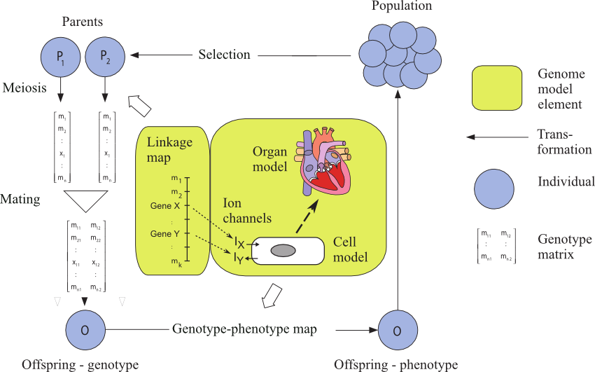
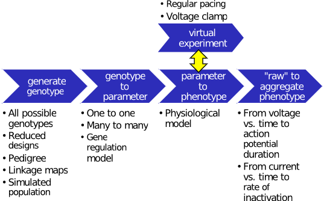

A toolbox for causally cohesive genotype-phenotype modeling
===========================================================

A comprehensive understanding of how genetic variation causes phenotypic 
variation of a complex trait is a long-term disciplinary goal of genetics. The 
basic premise is that in a well-validated model that is capable of accounting 
for the phenotypic variation in a population, the causative genetic variation 
will manifest in the model parameters.

In this context, the term :term:`phenotype`
refers to any relevant measure of model behaviour, whereas the term 
:term:`parameter` denotes a quantity that is constant over the time-scale of the 
particular model being studied. However, even the lowest-level :doi:`model 
parameters are themselves phenotypes <10.1534/genetics.108.087064>`, 
whose genetic basis may be mono-, oligo- or polygenic, and whose physiological 
basis can be mechanistically modelled at ever deeper levels of detail.

The term :term:`causally cohesive genotype-phenotype modeling` (cGP modeling) 
thus denotes an 
approach where low-level parameters have an articulated relationship to the 
individual's genotype, and higher-level phenotypes emerge from the 
mathematical model describing the causal dynamic relationships between these 
lower-level processes. It aims to bridge the gap between standard population 
genetic models that simply assign phenotypic values directly to genotypes, and 
mechanistic physiological models without an explicit genetic basis. This 
forces a causally coherent depiction of the genotype-to-phenotype (GP) map.

The :wiki:`Virtual Physiological Human` 
`Network of Excellence <http://www.vph-noe.eu>`_ 
aims to apply multilevel physiological modelling in patient-specific 
healthcare and in simulation studies of disease-related processes.
This requires expanding the scope of multilevel physiological modeling 
to the genome and population levels. The multi-level systems in 
:ref:`framework-figure` imply a mapping from low-level parameters to 
clinically relevant phenotypes. Supplemented by a link from genomic 
databases to model parameters, this defines what we call a causally 
cohesive genotype-phenotype (cGP) model. Tailoring treatment to 
individual genetics is a stated goal of 
`VPH in the post-Genomic era
<http://www.vph-noe.eu/vph-repository/doc_download/13-vph-noe-promotional-flyer-v1>`_. 
However, understanding gene-disease associations requires 
population-level analyses accounting for genetic interactions and 
genotype frequencies in the population.

.. _framework-figure:

Integrating genetics, genomics, and multiscale models in a population context
-----------------------------------------------------------------------------

   In the illustration, a gene codes for ion-channel parameters, which 
   affect transmembrane currents and the action potential of a heart cell. 
   Genetically determined variation in low-level parameters propagates 
   through multiple levels of electrophysiological, mechanical and fluid 
   dynamic processes. Phenotypic variation emerges at each level of 
   organization. A cGP model integrates a multiscale model of this 
   biological system with a linkage map through the genes encoding ion 
   channels, thus the cGP model describes the creation of new genotypes as a 
   result of meiosis and mating as well the phenotypes arising from these 
   genotypes. By simulating populations of cGP models, whose 
   parameters arise by recombination of virtual genomes, we can obtain a 
   deeper understanding of the high-dimensional in silico phenotypic data.

.. contents::

Aims of the toolbox
===================

The cGPtoolbox aims to facilitate researchers' entry into cGP modeling by 
providing a cGP modelling framework in a population context, integrating and 
interfacing with existing VPH tools. The toolbox will provide the means for 
extensive explorative *in silico* studies as well as integration of 
patient-specific information in multiscale models to account for the 
individual’s genotype in the model parameterisation process. It adds to the 
VPH Toolkit by integrating genetic structure information, bioinformatic 
information and infrastructure and multiscale and multiphysics models and 
associated infrastructure. The strength of the cGP toolbox as a relevant 
research tool will be illustrated by specific examples of use:

* as an explorative tool for better understanding of key genetic concepts 
  like dominance, epistasis, pleiotropy, penetrance and expressivity
  in biologically realistic complex trait situations and in a 
  patient-specific perspective;
* to elucidate the fine structure of the distribution of individuals in a 
  high-dimensional phenotypic landscape associated with a pathological 
  condition as a function of genetic variation;
* as a test bed for developing new fine mapping methodologies within 
  statistical genetics aimed at exploiting high-dimensional phenotypic 
  information.

The cgptoolbox is a step towards providing computational tools for 
attaching GP maps of parameters to a multiscale modelling framework in 
order to handle patient-specific issues. We think this is an important 
delivery preparing for a future situation where acquisition of 
high-dimensional phenotypic data from patients become routine 
(:doi:`phenomics <10.1038/nrg2897>`) and the VPH community has come 
closer to its key goal of achieving more integration across multiple 
spatial and temporal scales.

Design philosophy
=================

The cGP toolbox will provide a streamlined interface from genomic 
databases to model parameter structures. At the population level, it 
provides functions for mating and recombining genomes, keeping track of 
chromosomal organization and genetic distances (map units) between genes, 
thereby simulating parameter values for the offspring. This 
infrastructure is common to any cGP study. See the :doc:`tutorials` for 
worked examples.

The workflow illustrated in :ref:`design-patterns` exemplifies the 
:wiki:`design pattern` we developed to facilitate the interchange and 
reuse of its components: the generation of genotypes (e.g. exhaustive 
enumeration or reduced designs), the mapping of genes to parameters 
(based on genome databases, e.g. the :doi:`mouse phenome project 
<10.1007/s00335-009-9208-3>`), physiological models (e.g. the 
:doi:`CellML <10.1093/bioinformatics/btn390>` and 
:doi:`SBML/BioModels <10.1093/nar/gkj092>` repositories) that map 
parameters to phenotypes, virtual experiments to generate phenotypes that 
are defined by the model system's response to some stimulus or 
perturbation (e.g. :isbn:`voltage clamping <047148685X>`), and 
aggregation from model dynamics to clinically relevant phenotypes (e.g. 
:wiki:`action potential` duration). This pipeline design allows the 
gluing together of appropriate tools for each task. For instance, 
experimental designs and statistical analyses were done in 
`R <http://www.r-project.org>`_, whereas virtual experiments were flexibly 
described in `Python <http://www.python.org>`_). The general approach 
should apply equally well to eventual whole-organ cGP studies.

.. _design-patterns:

Design patterns for cGP studies
-------------------------------

   Simulation pipeline for causally cohesive genotype-phenotype studies. 
   Blue arrows denote functions that generate genotypes or transform them 
   through successive mappings, genotype to parameter to "raw" phenotypes to 
   aggregated phenotypes. The surrounding text exemplifies different 
   alternatives for each piece of the pipeline. :term:`Virtual experiment`\ s 
   interact with physiological models to generate phenotypes defined by the 
   system's response to external stimuli.

About the cgptoolbox
====================

Genetics is defined as the :wiki:`science of genes, heredity, and the 
variation of organisms <genetics>`. Gaining a real understanding of the 
variation of organisms as a function of genes and environment in a 
mechanistic sense, i.e understanding the genotype-phenotype map (GP map) 
- is a tremendous challenge that awaits technological, conceptual and 
methodological breakthroughs. But this is where we have to go if we aim 
for a future genetics theory that bridges the genotype-phenotype gap by 
both generic and specific causal explanatory models. The impact of a 
mature genetics theory such as this on production biology, evolutionary 
biology and biomedicine can hardly be overstated. Recent breakthroughs 
concerning large-scale, high-throughput genotyping and phenotyping 
instrumentation and methodological means to model very complex biological 
structures based on lower-level processes suggest that it is not 
premature to make heuristic use of this vision in terms of research 
programme objectives. The establishment of such a theory will of 
necessity have to involve the extensive use of mathematics, statistics, 
informatics and biological physics guided by biological data in the 
broader sense, it will force new developments within these disciplines, 
and it will have to involve very advanced eInfrastructures. The VPH 
programme provides a very promising conceptual and methodological base 
for such a theory development given that it establishes a better 
interface with the theoretical as well as experimental genetics 
communities. We propose that one of the best ways to facilitate this 
development is to integrate with existing `VPH tools 
<http://toolkit.vph-noe.eu/>`_ a modelling framework which can handle GP 
map issues associated with multiscale models in a population context, and 
illustrate how it can be used by the genetics research community to 
address some of its key disciplinary issues otherwise beyond reach. A set 
of community tools facilitating the use of such a modelling framework is 
the planned core deliverable of this exemplar project.

Glossary
========

.. glossary::
   :sorted:   

   parameter
      Here, we define a parameter as a quantity that may differ between 
      instances of a model system, but is constant over the time-scale of the 
      particular model being studied. 
   
   :wiki:`phenotype`
      An organism's observable characteristics or traits.

   causally cohesive genotype-phenotype modeling
      A modeling approach where low-level parameters have an articulated 
      relationship to the individual's genotype, and higher-level phenotypes 
      emerge from the mathematical model describing the causal dynamic 
      relationships between these lower-level processes.
   
   virtual experiment
      A simulated manipulation of a model system, designed to characterize 
      certain aspects of its behaviour in response to perturbation. This 
      provides a basis for comparing models with each other, and with real 
      systems if the experiment has a real-world analogue.

Contents
========

.. toctree::
   :maxdepth: 4
   
   cgp-programme
   features
   tutorials
   cgptoolbox-characterization
   cgp

Indices and tables
==================

* :ref:`genindex`
* :ref:`modindex`
* :ref:`search`
